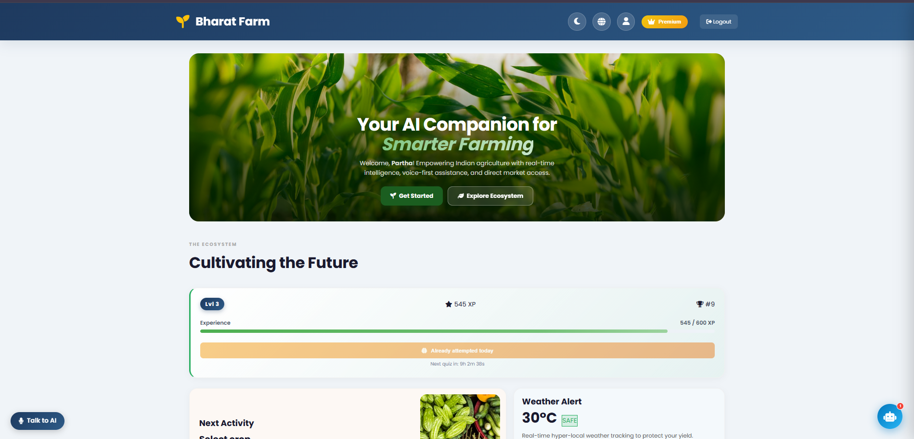
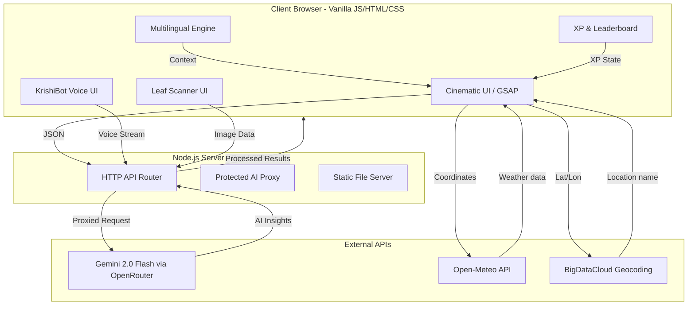

# 🌾 BharatFarm — The Future of Indian Agriculture


<div align="center">
  
  
  
  
  
</div>

<br/>

> **BharatFarm** is a visionary agricultural ecosystem designed to bridge the digital divide in rural India. By combining **Generative AI**, **Computer Vision**, and **Cinematic Web UX**, we provide farmers with a "digital companion" that speaks their language and secures their livelihood.

---

## 🎨 Visual Showcase

<div align="center">
  
  <p><i>The Premium AI-Powered Dashboard featuring real-time KrishiBot, Leaf Scanner, and XP Leaderboard</i></p>

---

## 🚨 The Problem vs 💡 The Solution

| Current Agricultural Challenges | The BharatFarm Solution |
| :--- | :--- |
| **Language Barrier:** Most digital tools are restricted to English, alienating 90% of Indian farmers. | **Full Multilingual Support:** The entire platform—including AI chat—is available in **Hindi, Bengali, and English**. |
| **Information Gap:** Farmers lack real-time access to expert agricultural advice in their native dialects. | **KrishiBot AI:** A 24/7 multilingual voice assistant providing instant contextual guidance via STT/TTS. |
| **Crop Diseases:** Delayed diagnosis leads to massive yield losses and excessive pesticide use. | **Gemini Vision Diagnostic:** Instant, highly accurate leaf disease detection from a single smartphone photo. |
| **Middle-men Exploitation:** Farmers are forced to sell produce at low margins to intermediaries. | **Direct Agri-Marketplace:** A zero-commission P2P platform connecting farmers directly to buyers. |

---

## 🚀 Core Innovations

### 1. 🤖 Intelligent Multilingual AI
- **🎙️ KrishiBot Assistant:** Powered by **Gemini 2.0 Flash** via OpenRouter, KrishiBot is a real-time AI companion utilizing **Speech-to-Text (STT)** and **Text-to-Speech (TTS)**. Farmers can *talk* to their application in their native tongue and get expert advice back via voice.
- **🍃 AI Leaf Scanner:** Diagnoses plant diseases with human-like precision using **Gemini Vision**, recommending exact fertilizers and treatments instantly. Correctly identifies non-plant images as "Not a Plant".
- **📚 Crop Health Wiki:** A comprehensive, searchable database of 34+ crop diseases, pests, and soil conditions seamlessly integrated with curated, localized treatment recommendations.

### 2. 🎮 XP-Based Gamification & Leaderboard
- **📈 XP Progression:** All farmer engagement is tracked through a unified **XP (Experience Points)** system. Users earn XP for quizzes, scans, chat interactions, and daily login streaks.
- **🏆 Leaderboard:** A competitive ranking system displays users alongside other farmers, sorted by XP. Rankings are shown on the dashboard and after quiz completion with 🥇🥈🥉 medals for the top 3.
- **🧠 Daily Agri-Quizzes:** An interactive daily quiz system testing knowledge on soil health, pest control, and market strategy. **Limited to one attempt per day** with a live countdown timer until the next quiz unlocks.
- **📊 Leveling System:** Users progress through levels with increasing XP thresholds, with streak bonuses rewarding consistent daily engagement.
- **🤝 Cross-Feature Hooks:** Users are automatically awarded XP for utilizing the AI Leaf Scanner and KrishiBot.

### 3. 🌍 Localization & Accessibility
- **🇮🇳 Native First:** Full UI localization for the major agricultural hubs of India. Switch between English, Hindi, and Bengali with a single click.
- **Accessibility Tokens:** High-contrast design and voice-first logic ensure that every farmer, regardless of literacy level or visual ability, can use the platform.

### 4. 📊 Precision Analytics
- **🌤️ Smart Weather:** Hyper-local weather data powered by **Open-Meteo** with soil moisture, soil temperature, and proximity-based safety alerts for farming operations. AI-generated weather advice for farmers.
- **💰 Financial Suite:** Professional cost and revenue calculators supporting local Indian land measurement units (**Acre, Bigha, Katha**).
- **🗺️ Activity Roadmap:** AI-generated day-by-day schedules tailored specifically to the selected crop's lifecycle.

### 5. 🏪 Agri-Marketplace
- **🛒 Direct Trade:** Zero-commission P2P marketplace connecting farmers directly to urban consumers.
- **📍 Location-Aware:** Auto-detects seller location via GPS with reverse-geocoding to populate state and district fields.
- **🔍 Smart Search:** Category-based filtering, search, and crop image matching for easy browsing.

---

## 🏗️ System Architecture



---

## 📁 Project Structure

## 📁 Project Structure

```bash
BharatFarm/
├── backend/
│   ├── server.js
│   ├── config.js
│   └── routes/
│       ├── auth.js
│       ├── crops.js
│       ├── weather.js
│       └── roadmap.js
│
├── frontend/
│   ├── index.html
│   ├── app.html
│   ├── info.html
│   ├── js/
│   └── css/
│
├── data/
│   ├── quizzes.json
│   ├── achievements.json
│   └── agriculture_diseases.json
│
├── api/
│   └── chat.js
│
├── assets/
├── .env
├── package.json
└── README.md

---

## 🔌 API Endpoints

| Method | Endpoint | Description |
| :--- | :--- | :--- |
| `POST` | `/api/chat` | AI chat proxy (KrishiBot + generic AI calls) |
| `POST` | `/api/schemes` | AI-powered government scheme matching |
| `POST` | `/api/analyze-leaf` | Gemini Vision leaf disease analysis |
| `GET` | `/api/wiki` | Crop Health Wiki database |
| `GET` | `/api/quizzes` | Daily quiz question bank |
| `GET` | `/api/leaderboard` | XP-based farmer leaderboard |
| `GET` | `/api/achievements` | Badge/achievement definitions |
| `POST` | `/submit-payment` | Payment screenshot verification |

---

## 🌎 Social Impact

By adopting the BharatFarm ecosystem, a typical rural farming community can expect:
- **⬆️ 15-20% Increase in Profit Margins:** Achieved through direct-to-consumer trade and precise cost calculations.
- **⬇️ 30% Reduction in Chemical Waste:** Driven by exact, AI-recommended fertilizer dosages.
- **⏱️ 24/7 Expert Accessibility:** Democratizing agricultural knowledge across the language barrier.

---

## 🛠️ Installation

1. **Clone & Install**
   ```bash
   git clone https://github.com/Souvik-Dey-2029/BharatFarm.git
   cd BharatFarm
   npm install
   ```

2. **Environment Setup**
   Create a `.env` file (see `sample.env`):
   ```env
   OPENROUTER_API_KEY=your_openrouter_api_key_here
   ```

3. **Run**
   ```bash
   node server.js
   ```
   Open **http://localhost:5000** in your browser.

---

## ⚙️ Tech Stack

| Layer | Technologies |
| :--- | :--- |
| **Frontend** | Vanilla HTML5, CSS3, JavaScript (ES6+), GSAP Animations |
| **Backend** | Node.js (native HTTP server), dotenv |
| **AI Engine** | Google Gemini 2.0 Flash (via OpenRouter API) |
| **Weather** | Open-Meteo API (free, no key required) |
| **Geocoding** | BigDataCloud Reverse Geocoding API |
| **Storage** | localStorage (client-side persistence) |
| **Deployment** | Vercel (serverless functions for production) |

---

## 👥 Meet the Architects

| Developer | Role | Profile |
| :--- | :--- | :--- |
| **Souvik Dey** | Lead Developer | [](https://www.linkedin.com/in/souvik-dey-400497366/) |
| **Partha Sarathi Sarkar**| Full Stack & Prompt Engineer | [](https://www.linkedin.com/in/partha-sarathi-sarkar-7385a8367/) |
| **Samrat Chatterjee** | AI Integration Architect | [](https://www.linkedin.com/in/samrat-chatterjee-2aa543368/) |
| **Snehasis Chakroborty**| UI/UX Motion Designer | [](https://www.linkedin.com/in/snehasis-chakraborty-2b68823a6/) |

---

<div align="center">
  <p><i>Demonstration project engineered for agricultural empowerment. Built with passion for a Digital India.</i> 🇮🇳</p>
  <p>&copy; 2026 BharatFarm. All Rights Reserved.</p>
</div>
